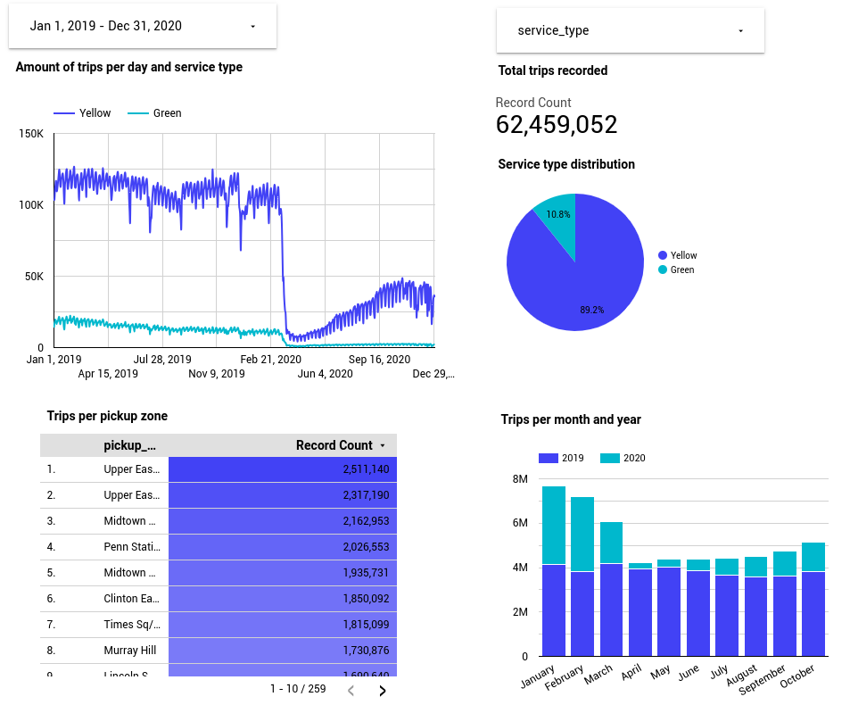

# Homework

## Building a source table: stg_fhv_tripdata

```sql
{{
    config(
        materialized='view'
    )
}}

select
    -- identifiers
    {{ dbt_utils.generate_surrogate_key(['dispatching_base_num', 'pickup_datetime']) }} as trip_id,
    dispatching_base_num,
    {{ dbt.safe_cast("pu_location_id", api.Column.translate_type("integer")) }} as pickup_location_id,
    {{ dbt.safe_cast("do_location_id", api.Column.translate_type("integer")) }} as dropoff_location_id,

    -- timestamps
    cast(pickup_datetime as timestamp) as pickup_datetime,
    cast(dropoff_datetime as timestamp) as dropoff_datetime,
    
    -- trip info
    sr_flag,
    affiliated_base_number
from {{ source('staging','fhv_tripdata') }}
where extract(year from pickup_datetime) = 2019

-- dbt build --select <model_name> --vars '{'is_test_run': 'false'}'


  limit 100


```

## Building a fact table: fact_fhv_trips
```sql
{{
    config(
        materialized='table'
    )
}}

with fhv_tripdata as (
    select *, 
    from {{ ref('stg_fhv_tripdata') }}
),  
dim_zones as (
    select * from {{ ref('dim_zones') }}
    where borough != 'Unknown'
)
select fhv_tripdata.trip_id, 
    fhv_tripdata.dispatching_base_num,
    fhv_tripdata.pickup_location_id,
    fhv_tripdata.dropoff_location_id,
    fhv_tripdata.pickup_datetime,
    fhv_tripdata.dropoff_datetime,
    fhv_tripdata.sr_flag,
    fhv_tripdata.affiliated_base_number
from fhv_tripdata
inner join dim_zones as pickup_zone
on fhv_tripdata.pickup_location_id = pickup_zone.locationid
inner join dim_zones as dropoff_zone
on fhv_tripdata.dropoff_location_id = dropoff_zone.locationid
```

## Create a dashboard

### Yellow & Green Tripdata



### FHV Tripdata

